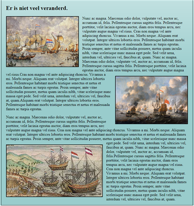

# B1W4L1 - Newspaper
## Created by Ricardo Froeliger

* Fork [this](https://github.com/davinci-ao/LAB3-Krantenartikel) repository and clone it to your PC.
* Make a webpage like the example.
* Make the text wrap around the images.
* Make sure there's enough space between the images and the text (CSS margin & padding).
* Make the images have a 2px thick black border.
* Use dummy text (Lorem ipsum). 
* Make sure the right files are in the right folders.

