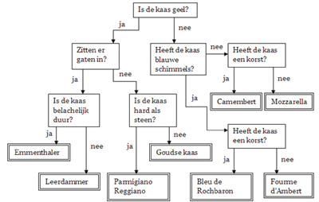

# B1W5L1 - Cheese
## Created by Ricardo Froeliger

As most of you know who the game 'who is it?' game, we are going to program a similar draw. 
The intention is that your program will find out which cheese you mean by asking questions. Below you see a tree structure of questions. You have to program this tree structure in javascript by using the 'if else' statements. You use the comparison to make comparisons.

