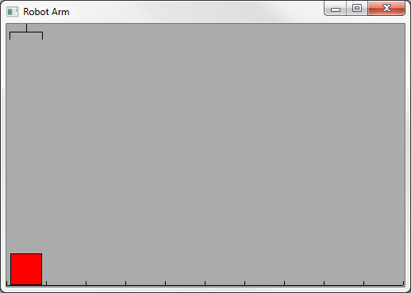
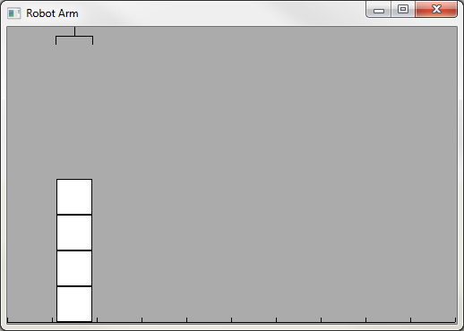
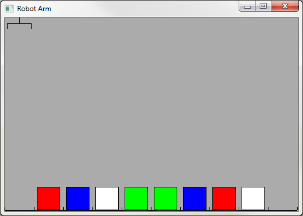
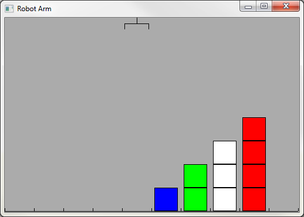
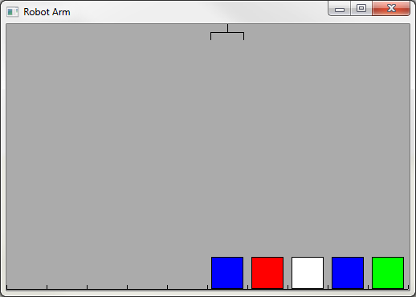
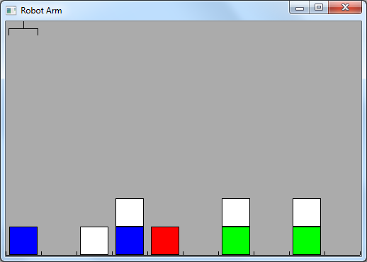

# B1W7O1 - Robotarm
## Exercises made by Ricardo Froeliger

### Setup Code Exercise 1 / 12
```javascript
<script>
    var canvas = document.getElementById("canvas");
    var robotArm = new RobotArm(canvas);

    robotArm.loadLevel("exercise 1");

    // Enter your code here

    robotArm.run();
</script>
```

### Exercise 1
Move the red block one space to the left.<br>


### Exercise 2
Stack all the blocks on the right.<br>


### Exercise 3
Move the entire stack of blocks one space to the right.<br>


### Exercise 4
Move the entire stack of blocks one space to the right. Make sure the order of the blocks remains the same.<br>


### Exercise 6
Move all blocks one space to the right. Make sure the order of the blocks remains the same.<br>


### Exercise 7
Move each stack one space to the left.<br>
**You may use up to 13 lines of code!**<br>


### Exercise 8
Move the stack to the right.<br>
**You may use up to 13 lines of code!**<br>


### Exercise 9
Move all stacks five positions to the right.<br>
**You may use up to 15 lines of code!**<br>


### Exercise 10
Reverse the order of the blocks.<br>
**You may use up to 20 lines of code!**<br>


### Exercise 11
Move all white blocks one space to the right.<br>
**Note: the blocks are different every time you start the program!**<br>


### Exercise 12
Move all red blocks to the end.<br>
**Note: the blocks are different every time you start the program!**<br>


## Setup Code Exercise 13
```javascript
<script>
  var canvas = document.getElementById("canvas");
  var robotArm = new RobotArm(canvas);

  robotArm.randomLevel( 1, 8);

  // Enter your code here

  robotArm.run();
</script>
```
### Exercise 13
Move all blocks over the empty places, as soon as there are no more blocks the arm must stop.

[Bonus Exercises](https://www.dropbox.com/s/7q4o3xboi5whgop/RobotArm%20Puzzels.docx?dl=0)